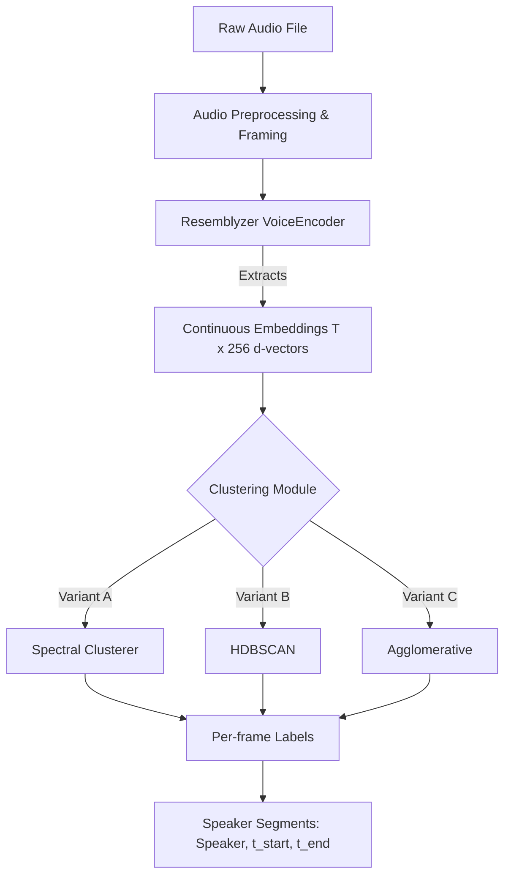

readme_content = """<div align="center">
  
# 🎙️ Speaker Diarization & Voice Recognition Pipeline

[](https://www.python.org/downloads/)
[](https://opensource.org/licenses/MIT)
[](https://github.com/psf/black)

> *"Who spoke when?"* — An advanced comparative framework for audio segmentation using Deep Learning embeddings and Unsupervised Clustering.

</div>

---

## 📖 Overview

Speaker Diarization is the process of partitioning an input audio stream into homogeneous segments according to the speaker's identity. This repository provides a robust, end-to-end pipeline designed to extract high-dimensional voice embeddings and cluster them to accurately identify multiple speakers in a single audio file. 

By leveraging **Resemblyzer** (based on Generalized End-to-End Loss for Speaker Verification) and comparing state-of-the-art clustering algorithms, this framework allows researchers and developers to analyze the trade-offs between deterministic clustering, density-based noise isolation, and spectral analysis.

## ✨ Key Features

* **Advanced Audio Analysis:** Built-in utilities for waveform visualization and spectrogram generation using `librosa`.
* **Deep Voice Embeddings:** Utilizes pre-trained GE2E models to generate sliding-window 256-dimensional d-vectors (~62ms resolution).
* **Multi-Algorithm Clustering:** Implements and compares three distinct unsupervised learning algorithms:
  * Spectral Clustering
  * HDBSCAN (Hierarchical Density-Based Spatial Clustering)
  * Agglomerative (Hierarchical) Clustering
* **Noise Handling:** Density-based approaches inherently isolate cross-talk, silence, and background noise.
* **Visual Evaluation:** Generate comparative timeline scatter plots and Agglomerative Dendrograms for deep analytical insights.

---

## ⚙️ Pipeline Architecture


```

```text
Created README-v2.md



---

## 🧠 Clustering Algorithms: A Deep Dive

This repository evaluates three methodologies to group voice embeddings into distinct speaker identities:

### 1. Spectral Clustering (The Standard)

Constructs a cosine-similarity affinity matrix, applies a Gaussian blur, computes the refined Laplacian eigendecomposition, and performs k-means on the top-k eigenvectors.

* **Strengths:** Excellent for conversations with well-separated, balanced speakers in clean audio environments.
* **Weaknesses:** Requires hyperparameter tuning for `max_clusters`. Memory intensive ($O(T^2)$ affinity matrix). Highly sensitive to noise and silence, often forcing non-speech frames into existing speaker clusters.

### 2. HDBSCAN (Density-Based Auto-K)

Builds a mutual-reachability graph and condenses a hierarchy of clusters to pick the most persistent ones without specifying $K$.

* **Strengths:** Automatically determines the number of speakers. Exceptionally robust against noise; frames that do not belong to a dense speaker region are accurately labeled as noise/silence (label `-1`).
* **Weaknesses:** Requires tuning of `min_cluster_size` and `min_samples` based on the recording's length and density.

### 3. Agglomerative Clustering (Bottom-Up Hierarchical)

Iteratively merges the two most similar clusters using a defined linkage strategy (`average` with `cosine` affinity is recommended for d-vectors) until a stopping criterion is met.

* **Strengths:** Deterministic and highly reproducible. Offers deep interpretability through Dendrogram visualization, allowing researchers to see exactly where and how clusters merge.
* **Weaknesses:** Requires specifying `n_clusters` or a strict distance threshold. Like Spectral, it lacks native noise handling and may classify sudden acoustic anomalies as entirely new speakers.

---

## 📊 Algorithm Comparison Summary

| Feature | SpectralClusterer | HDBSCAN | Agglomerative |
| --- | --- | --- | --- |
| **Speaker Count ($K$)** | Requires Range (`min/max`) | **Auto-detected** | Required (or distance threshold) |
| **Noise/Silence Handling** | Poor (Forces into clusters) | **Excellent** (Native `-1` label) | Poor (May create false speakers) |
| **Time Complexity** | Moderate | **Fast** ($O(T \log T)$) | Moderate ($O(T^2)$ for non-ward) |
| **Memory Footprint** | High ($O(T^2)$ affinity mat) | Low | High ($O(T^2)$ affinity mat) |
| **Reproducibility** | Non-deterministic (k-means) | **Deterministic** | **Deterministic** |

---

## 🚀 Installation & Setup

1. **Clone the repository:**
```bash
git clone [https://github.com/yourusername/speaker-diarization-pipeline.git](https://github.com/yourusername/speaker-diarization-pipeline.git)
cd speaker-diarization-pipeline

```


2. **Create a virtual environment (Recommended):**
```bash
python -m venv venv
source venv/bin/activate  # On Windows: venv\\Scripts\\activate

```


3. **Install dependencies:**
```bash
pip install -r requirements.txt

```


*(Core requirements include: `webrtcvad`, `spectralcluster`, `pydub`, `resemblyzer`, `hdbscan`, `librosa`, `scikit-learn`, `scipy`, `matplotlib`)*

---

## 🛠️ Quick Start

```python
from resemblyzer import preprocess_wav, VoiceEncoder
from pathlib import Path
import hdbscan
from sklearn.preprocessing import normalize

# 1. Load and preprocess audio
wav_fpath = Path("sample_audio.wav")
wav = preprocess_wav(wav_fpath)

# 2. Extract Embeddings
encoder = VoiceEncoder("cpu")
_, cont_embeds, wav_splits = encoder.embed_utterance(wav, return_partials=True, rate=16)

# 3. L2-Normalize and Cluster (using HDBSCAN)
embeds_normed = normalize(cont_embeds, norm='l2')
clusterer = hdbscan.HDBSCAN(min_cluster_size=15, metric='euclidean')
labels = clusterer.fit_predict(embeds_normed)

# Labels now contain the speaker ID for each ~62ms frame.
# Noise/Silence frames are labeled as -1.

```

---

## 📈 Visualizations

The pipeline includes built-in functions to generate comprehensive comparative visual plots. By visualizing the per-frame speaker assignments on a shared timeline, researchers can easily diagnose over-segmentation, silence misclassification, and algorithmic agreement.

---

## 🤝 Contributing

Contributions, issues, and feature requests are welcome!
Feel free to check the [issues page](https://www.google.com/search?q=https://github.com/yourusername/speaker-diarization-pipeline/issues) for open tasks.

## 📚 Acknowledgments

* [Resemblyzer](https://github.com/resemble-ai/Resemblyzer) for the GE2E VoiceEncoder implementation.
* [HDBSCAN](https://github.com/scikit-learn-contrib/hdbscan) for density-based clustering.
* [SpectralClusterer](https://github.com/wq2012/SpectralCluster) by Quan Wang.
any further refinements!

```
